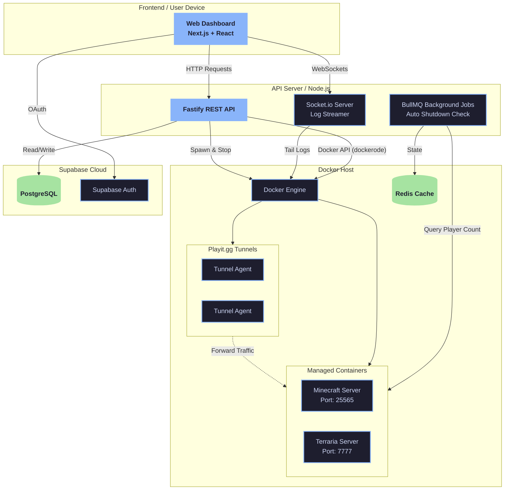

# SpawnCtl 🚀

> A Self-Service Game Server Hosting Platform for Minecraft & Terraria.

**SpawnCtl** is a lightweight, multi-tenant game server management panel built specifically for single-host deployments. It allows users to instantly spin up game servers (Minecraft or Terraria) on demand, exposes them securely to the public internet without port-forwarding using Playit.gg, and automatically shuts them down when idle to conserve system resources.

---

## 🎯 What & Why?

**What it does:**
- Provides a clean, modern Next.js Dashboard to manage and monitor game servers.
- Spawns isolated Docker containers for each game instance.
- Creates instant public IP tunnels via Playit.gg, bypassing the need for manual port forwarding or router access.
- Features an "Auto-Shutdown" system that queries server player counts (via TCP Ping or REST API) and turns off empty servers to save RAM/CPU.
- Streams live console logs straight to the web browser via WebSockets.

**Why it was built:**
Running dedicated game servers 24/7 consumes significant resources, but friends usually only play for a few hours a day. Existing panels (like Pterodactyl) are powerful but extremely heavy and complex to set up. SpawnCtl was built to be a simple, "Self-Service" alternative—anyone can click a button, get a server instantly, play, and the system cleans up after them when they leave.

---

## 🏗️ Architecture

SpawnCtl uses a decoupled Architecture consisting of a Next.js Frontend and a Fastify Backend, connected to a local Docker Daemon and Supabase for state management.



---

## 💻 Tech Stack

### Frontend (Apps/Web)
- **Framework:** Next.js 16 (App Router, Server Components)
- **Styling:** Tailwind CSS + shadcn/ui
- **State Management:** TanStack Query v5
- **Real-time:** Socket.io-client

### Backend (Apps/API)
- **Framework:** Fastify 4 + Node.js (TypeScript)
- **Validation:** Zod
- **Queue/Jobs:** BullMQ + Redis (Auto-shutdown checks)
- **Docker Integration:** `dockerode`
- **Real-time:** Socket.io

### Database & Auth
- **Database:** Supabase (PostgreSQL) + Row Level Security (RLS)
- **Authentication:** Supabase Auth (Google OAuth + SSR)

### Infrastructure
- **Monorepo:** pnpm workspaces + Turborepo
- **Containerization:** Docker Desktop
- **Networking:** Playit.gg CLI (For NAT traversal / Public IPs)

---

## 🚀 How It Works (The Flow)

1. **Authentication:** User logs in via Google OAuth. The Frontend exchanges tokens with Supabase and passes the JWT to the Fastify API.
2. **Server Creation:** User clicks "Start Server". The API verifies their identity, checks available RAM using the Docker Stats API, and provisions two linked Docker containers: one for the game (`itzg/minecraft-server` or `beardedio/terraria`) and one for the Playit tunnel.
3. **Log Streaming:** Once running, the Web UI subscribes to a Socket.io room. The Backend attaches to the Docker container's stdout/stderr and streams logs directly to the user's browser in a stylized terminal.
4. **Public IP Parsing:** The Backend automatically scans the Playit tunnel logs to extract the dynamically assigned Public IP and Port, saving it to Supabase so it appears on the Dashboard.
5. **Auto Shutdown Guard:** Every 5 minutes, BullMQ triggers a background job. It pings all running servers (via TCP ping or REST API) to check the current player count. If the server has 0 players for two consecutive checks (10 minutes idle), the Backend gracefully stops the Docker containers.

---

## 🛠️ Local Development Setup

### Prerequisites
- Node.js (v22+)
- pnpm (v9+)
- Docker Desktop (Running on Windows/Mac/Linux)
- A Supabase Project (Free Tier)
- A Redis Server (Can be run via Docker)

### 1. Clone & Install
```bash
git clone https://github.com/yourusername/SpawnCtl.git
cd SpawnCtl
pnpm install
```

### 2. Environment Variables
Copy the `.env.example` file in the root directory to `.env` and fill in your Supabase credentials:

```bash
cp .env.example .env
```

### 3. Setup Database
Run the Supabase migrations to set up the `servers` table, Row Level Security (RLS) policies, and triggers. You can find the migration file in `supabase/migrations/20260518000000_create_servers.sql`.

### 4. Start Redis
```bash
docker run -d --name SpawnCtl-redis -p 6379:6379 redis:alpine
```

### 5. Run the Project
Start both the Frontend and Backend concurrently using Turborepo:
```bash
pnpm dev
```
- **Web UI:** http://localhost:3000
- **API Server:** http://localhost:4000

---

